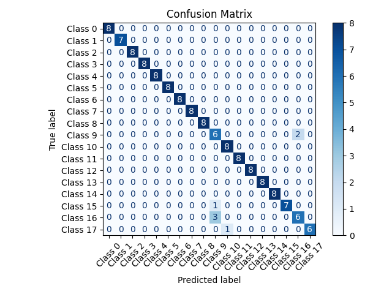

# Hand Gesture Recognition with MediaPipe & Bidirectional LSTM



> **Project type:** Software Development Project (SDP)  
> **Goal:** Train a deep‑learning model that recognises 17 static hand gestures in real‑time from a laptop/USB camera.

---

## ✨ Key Features
- **MediaPipe Hands** to extract 21‑point hand landmarks from frames.
- **Sequence Assembly** of landmark vectors into fixed‑length `.npy` files (see `dataset_landmark_sequences/`).
- **Bidirectional LSTM‑based classifier** (`lstm_train_model.py`) with cosine‑decay restart scheduler.
- **Early‑Stopping & Checkpoints** – best weights saved to `best_lstm_model.keras`.
- **Real‑time Inference** (`real_time_video_capture.py`) with on‑screen annotation **& optional TTS** feedback.
- **Training artefacts** – accuracy/loss curves, ROC curve, confusion‑matrix.

---

## 📂 Directory Layout

```text
sdp-project/
├── dataset_landmark_sequences/    # Pre‑processed gesture sequences (.npy)
├── lstm_train_model.py            # Model‑building & training script
├── split_dataset.py               # Train/val/test split helper
├── real_time_video_capture.py     # Webcam demo (inference)
├── best_lstm_model.keras          # ⭐ best validation checkpoint
├── lstm_trained_model.keras       # Model after final epoch
├── lstm_training_history.json     # Saved history for plots
├── roc_curve.png                  # ROC curve
├── Accuracy and Loss Curves.png   # Training curves
├── confusion_matrix.png           # Confusion matrix
└── README.md                      # **You are here**
```

---

## 🔧 Requirements

| Package | Tested Version |
|---------|----------------|
| Python  | 3.9 / 3.10     |
| TensorFlow | ≥ 2.12 |
| NumPy | ≥ 1.23 |
| OpenCV‑Python | ≥ 4.10 |
| MediaPipe | ≥ 0.10 |
| scikit‑learn | ≥ 1.3 |
| matplotlib | ≥ 3.8 |
| pyttsx3 (optional TTS) | ≥ 2.90 |

Create a **`requirements.txt`** from the above or install manually:

```bash
pip install -r requirements.txt
```

---

## 🚀 Quick‑Start

```bash
# 1) Clone the repo (after you push it to GitHub)
git clone https://github.com/<YOUR_USERNAME>/sdp-project.git
cd sdp-project

# 2) (Optional) Create & activate a virtual environment
python -m venv venv && source venv/bin/activate  # Windows: venv\Scripts\activate

# 3) Install deps
pip install -r requirements.txt

# 4) Train the model (≈ 5–10 min on GPU ‑ adjust batch/epochs in script)
python lstm_train_model.py

# 5) Run the real‑time demo
python real_time_video_capture.py
```

> **Note:** The `dataset_landmark_sequences/` folder already contains sample sequences for 17 gestures. Replace or extend with your own data and update the label mapping inside `real_time_video_capture.py` if you add/remove classes.

---

## 📊 Results

| Metric | Value |
|--------|-------|
| Training accuracy | **99.3 %** |
| Validation accuracy | **92.3 %** |
| Validation loss | 0.23 |
| ROC‑AUC | See `roc_curve.png` |


---

## 🏗️ How It Works

1. **Landmark Extraction** – `dataset_landmarks.py` iterates over raw image folders, runs MediaPipe Hands, and stores 21×3 normalised landmark coordinates.
2. **Sequence Building** – consecutive frames are stacked into sequences of equal length (default = 30) and saved as `.npy` arrays.
3. **Model** – two Bi‑LSTM layers with layer‑norm, dropout and dense softmax output.
4. **Training** – cosine‑decay restarts, early‑stopping; class imbalance handled via `class_weight`.
5. **Inference** – webcam frames → landmarks → sliding‑window buffer → model prediction → overlay + optional speech.

---

## 🖥️ Real‑Time Demo

Run:

```bash
python real_time_video_capture.py
```

- Press **`q`** to quit.
- Predictions with confidence ≥ 0.7 are displayed.
- Enable audio feedback by keeping `pyttsx3` installed.


---

## 📝 Acknowledgements
- [MediaPipe](https://github.com/google/mediapipe)
- TensorFlow/Keras
- This work was completed as part of the 6th‑semester **Software Development Project** course at **XYZ University**.

## 📜 License
Released under the MIT License – see [`LICENSE`](LICENSE) for details.
